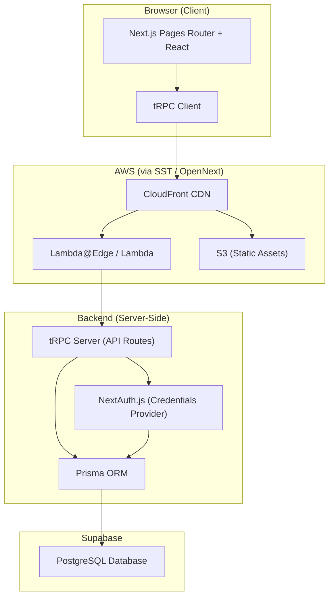
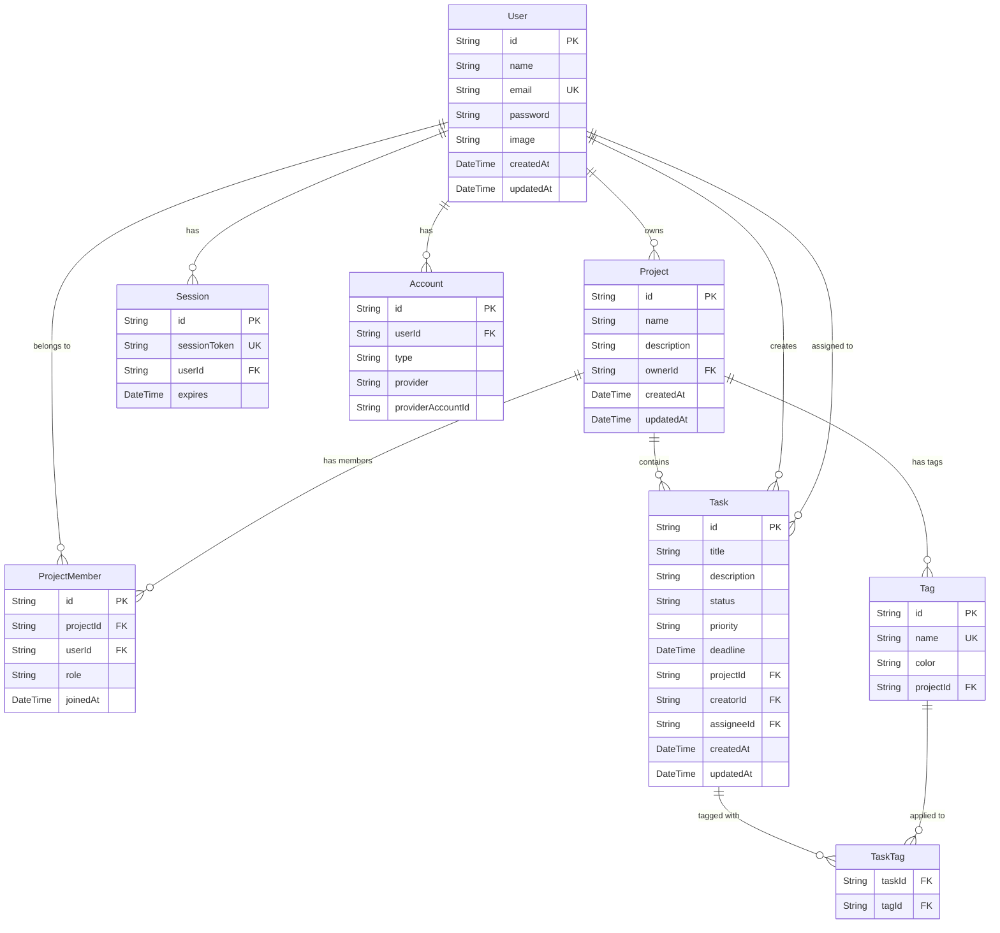
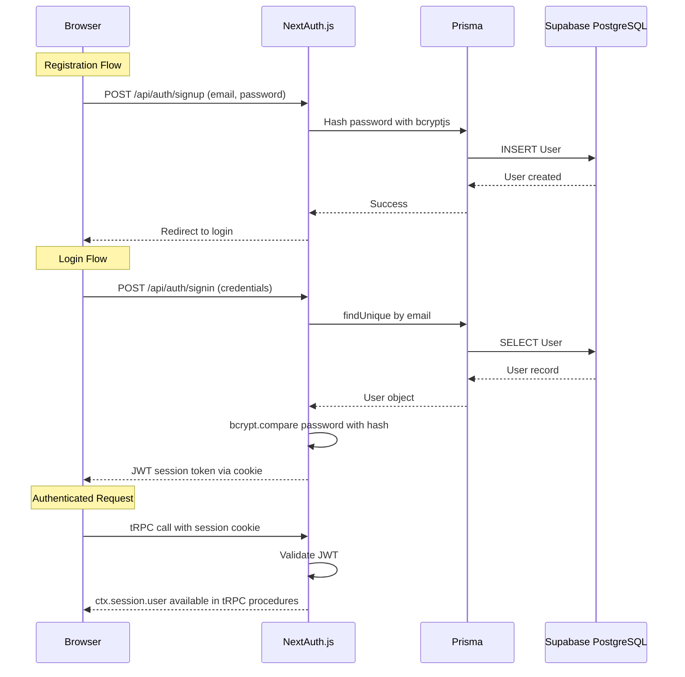
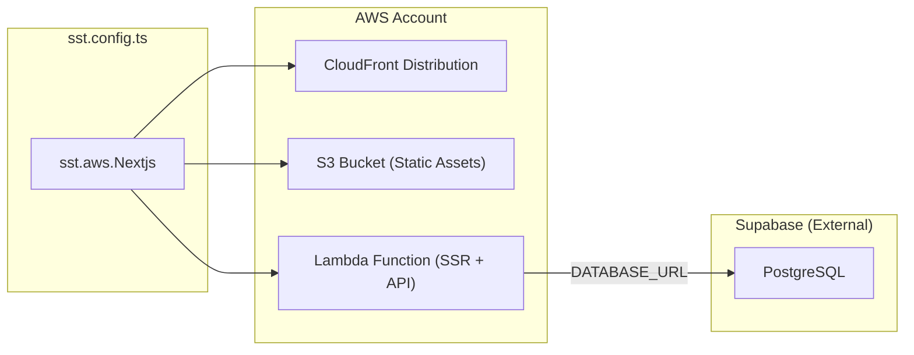

# Architecture — Task Management & Collaboration Tool

## 1. System Overview

A full-stack task management and collaboration application allowing teams to create, assign, track, and manage tasks with deadlines, priorities, tags, and team member assignments.



---

## 2. Tech Stack (Mandated)

| Layer | Technology | Version / Notes |
|---|---|---|
| **Framework** | Next.js (Pages Router) | T3 scaffold, **no** App Router |
| **Language** | TypeScript | Strict mode |
| **Styling** | Tailwind CSS | As specified in task |
| **API Layer** | tRPC | End-to-end typesafe RPC |
| **Auth** | NextAuth.js | Credentials provider (email + password) |
| **ORM** | Prisma | PostgreSQL provider |
| **Database** | Supabase (PostgreSQL) | Managed Postgres, connection pooler |
| **Deployment** | SST (Serverless Stack) | Deploys to AWS via `sst.aws.Nextjs` + OpenNext |
| **Cloud** | AWS | Lambda, CloudFront, S3 |
| **Scaffold** | `npm create t3-app@7.37.0` | Exact version specified |

---

## 3. Project Scaffold Options

```
npm create t3-app@7.37.0
  ◇ TypeScript
  ◇ Tailwind CSS — Yes
  ◇ tRPC — Yes
  ◇ NextAuth.js
  ◇ Prisma
  ◇ App Router — No (Pages Router)
  ◇ PostgreSQL
```

---

## 4. Database Schema (ERD)



### Key Schema Decisions

| Decision | Rationale |
|---|---|
| `User.password` field added to default NextAuth schema | Required for Credentials provider (email/password login) |
| Passwords hashed with `bcryptjs` | Industry standard; no plain-text storage |
| `Project` as a top-level entity | Tasks are scoped to projects for multi-team collaboration |
| `ProjectMember` join table with `role` | Supports roles like `OWNER`, `ADMIN`, `MEMBER` |
| `Task.status` as enum string | Values: `TODO`, `IN_PROGRESS`, `IN_REVIEW`, `DONE` |
| `Task.priority` as enum string | Values: `LOW`, `MEDIUM`, `HIGH`, `URGENT` |
| Separate `Tag` + `TaskTag` tables | Many-to-many relationship, project-scoped tags |
| `Session` + `Account` tables | Standard NextAuth / Prisma Adapter schema |
| Supabase connection pooler (port 6543) for `DATABASE_URL` | Prevents connection exhaustion in serverless Lambda |
| `DIRECT_URL` (port 5432) for Prisma migrations | Migrations need direct connection, not pooled |
| RLS enabled with no permissive policies | Blocks direct Supabase Data API access to app tables |

---

## 5. Authentication Flow



### Auth Design Choices

- **NextAuth.js Credentials Provider** — The task requires email/password login, so we use the Credentials provider rather than OAuth.
- **JWT Session Strategy** — Since Credentials provider doesn't natively support database sessions in NextAuth, we use `strategy: "jwt"`.
- **Prisma Adapter** — Manages the `User`, `Account`, and `Session` tables for NextAuth's internal needs.
- **Signup API Route** — NextAuth doesn't have a built-in signup flow; we create a custom `/api/auth/signup` route that hashes the password and creates the user via Prisma.

---

## 6. tRPC Router Structure

```
src/server/api/
├── root.ts              # Merges all routers
├── trpc.ts              # tRPC initialization, context, middleware
└── routers/
    ├── auth.ts          # Signup (custom), profile management
    ├── project.ts       # CRUD for projects, member management
    ├── task.ts          # CRUD for tasks, assignment, status updates
    ├── tag.ts           # CRUD for tags, task-tag associations
    └── dashboard.ts     # Aggregation queries for dashboard (optional)
```

### Middleware Layers

| Middleware | Purpose |
|---|---|
| `publicProcedure` | Unauthenticated routes (signup, health check) |
| `protectedProcedure` | Requires valid session (injected `ctx.session.user`) |
| `projectMemberProcedure` | Requires authenticated user + membership in the target project |

---

## 7. Page Structure (Pages Router)

```
src/pages/
├── _app.tsx                 # Session provider, tRPC provider, global layout
├── index.tsx                # Landing / redirect to dashboard
├── auth/
│   ├── signin.tsx           # Login page
│   └── signup.tsx           # Registration page
├── dashboard/
│   └── index.tsx            # Central dashboard (optional feature)
├── projects/
│   ├── index.tsx            # List all projects
│   ├── new.tsx              # Create project
│   └── [projectId]/
│       ├── index.tsx        # Project detail / task board
│       ├── settings.tsx     # Project settings, member management
│       └── tasks/
│           ├── new.tsx      # Create task
│           └── [taskId].tsx # Task detail / edit
└── profile/
    └── index.tsx            # User profile & preferences
```

---

## 8. AWS Infrastructure (via SST)



### `sst.config.ts` (High-Level)

```typescript
/// <reference path="./.sst/platform/config.d.ts" />

export default $config({
  app(input) {
    return {
      name: "task-management",
      removal: input?.stage === "production" ? "retain" : "remove",
      home: "aws",
    };
  },
  async run() {
    new sst.aws.Nextjs("TaskManagementWeb", {
      environment: {
        DATABASE_URL: process.env.DATABASE_URL!,
        NEXTAUTH_SECRET: process.env.NEXTAUTH_SECRET!,
        NEXTAUTH_URL: process.env.NEXTAUTH_URL!,
      },
    });
  },
});
```

### Environment Variables

| Variable | Source | Purpose |
|---|---|---|
| `DATABASE_URL` | Supabase Dashboard -> Settings -> Database | Pooled connection string for the dedicated `prisma` role (port 6543) |
| `DIRECT_URL` | Supabase Dashboard -> Settings -> Database | Direct/session connection for Prisma migrations with the dedicated `prisma` role (port 5432) |
| `NEXTAUTH_SECRET` | Generated (`openssl rand -base64 32`) | JWT signing secret |
| `NEXTAUTH_URL` | CloudFront domain or custom domain | Base URL for NextAuth callbacks |

---

## 9. Component Architecture (UI)

```
src/components/
├── layout/
│   ├── AppLayout.tsx        # Sidebar + main content wrapper
│   ├── Sidebar.tsx          # Navigation sidebar
│   └── Header.tsx           # Top bar with user menu
├── auth/
│   ├── LoginForm.tsx        # Email/password login form
│   └── SignupForm.tsx       # Registration form
├── projects/
│   ├── ProjectCard.tsx      # Project summary card
│   └── ProjectForm.tsx      # Create/edit project form
├── tasks/
│   ├── TaskBoard.tsx        # Kanban-style task board
│   ├── TaskCard.tsx         # Individual task card
│   ├── TaskForm.tsx         # Create/edit task form
│   ├── TaskFilters.tsx      # Filter by status, priority, assignee, tags
│   └── TaskDetail.tsx       # Full task detail view
├── tags/
│   ├── TagBadge.tsx         # Colored tag badge
│   └── TagPicker.tsx        # Multi-select tag picker
├── profile/
│   └── ProfileForm.tsx      # Edit user profile
├── dashboard/
│   ├── StatsCards.tsx       # Task count summaries
│   ├── DeadlineTimeline.tsx # Upcoming deadlines
│   └── RecentActivity.tsx   # Recent task updates
└── ui/
    ├── Button.tsx
    ├── Input.tsx
    ├── Select.tsx
    ├── Modal.tsx
    ├── DatePicker.tsx
    └── Avatar.tsx
```

---

## 10. Key Integration Points & Gotchas

### ⚠️ Supabase + Prisma in Serverless
- Always use the **connection pooler URL** (port `6543`, Transaction Mode) for `DATABASE_URL` in production/Lambda.
- Use the **direct URL** (port `5432`) only for `DIRECT_URL` (used by `prisma migrate`).
- Use the dedicated `prisma` database role documented in `docs/supabase-security.md`.
- RLS is enabled on app tables with no permissive policies to block direct Supabase Data API access.
- Application authorization must still be handled in tRPC middleware; do not depend on Supabase Auth `auth.uid()` policies because this app uses NextAuth.
- Remove `public` from Supabase exposed schemas if the app remains Prisma-only.

### ❗ NextAuth Credentials Provider Limitations
- NextAuth does not provide a built-in signup page or API route for the Credentials provider. You must implement `/api/auth/signup` manually.
- The Credentials provider requires `strategy: "jwt"` for sessions (database sessions are not supported with Credentials).
- The `PrismaAdapter` still manages User/Account/Session tables, but JWT is the active session mechanism.

### ℹ️ SST Deployment
- SST uses OpenNext to package the Next.js app for AWS Lambda + CloudFront + S3.
- `sst dev` enables live Lambda development with hot reload.
- `sst deploy --stage production` deploys to the production stage.
- Environment variables are passed via `sst.config.ts` or SST secrets.
